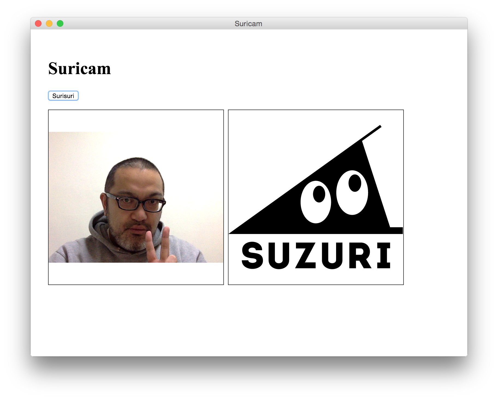
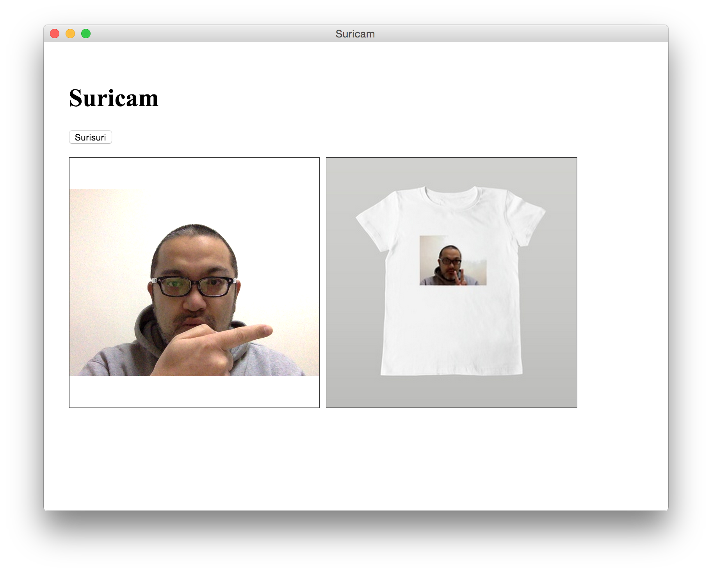

# Suricam

[NW.js(旧node-webkit)](https://github.com/nwjs/nw.js)と[SUZURI API](https://suzuri.jp/developer/)を用いて、内蔵カメラで撮影した写真で、Tシャツを作ります。

## 起動方法

1. [NW.js(旧node-webkit)](https://github.com/nwjs/nw.js)をインストールします。
2. Macの場合、以下のようにして起動します。

```
$ /Applications/nwjs.app/Contents/MacOS/nwjs . API_TOKEN
```

`API_TOKEN`は、[SUZURI Developer Center](https://suzuri.jp/developer/)から取得してください。

## 画面

こんな感じの画面が出るので、



ボタンを適当に押すと、SUZURI上でTシャツが作成されて、以下のように結果が表示されます。



んでもって、こんな感じのURLで実際にTシャツができて、販売できます。

https://suzuri.jp/kentaro/175372/t-shirt/gl/white

## License

MIT
